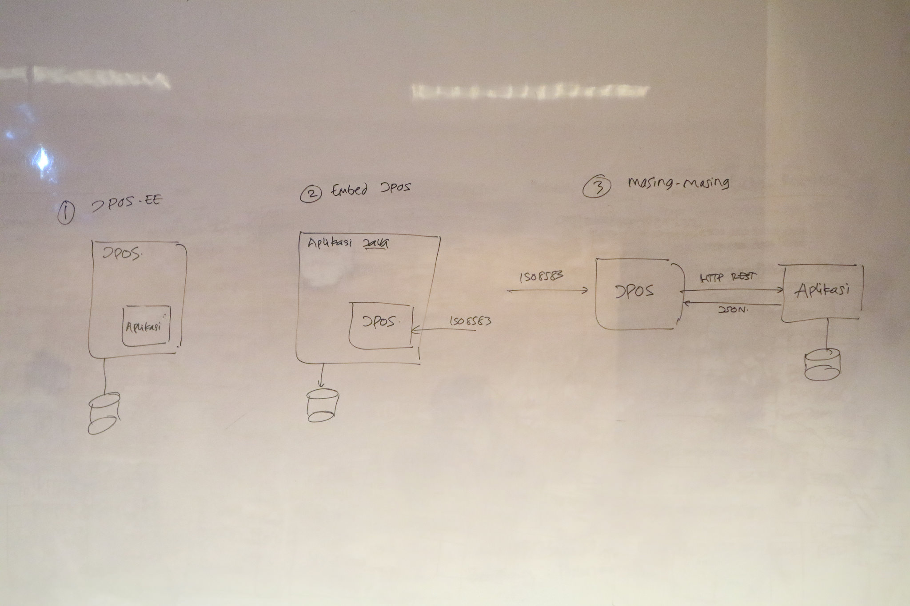

# Training ISO8583 dengan JPos

Berbagai alternatif arsitektur aplikasi menggunakan JPOS

[](https://www.flickr.com/photos/endymuhardin/25360792769/in/dateposted/)

## Deployment Aplikasi Backend

* URL untuk lihat daftar rekening : https://pelatihan-backend.herokuapp.com/api/rekening/
* URL untuk lihat informasi akun : https://pelatihan-backend.herokuapp.com/api/rekening/001/
* URL untuk lihat mutasi rekening : https://pelatihan-backend.herokuapp.com/api/rekening/001/mutasi/
* URL untuk posting mutasi (gunakan method POST) : https://pelatihan-backend.herokuapp.com/api/rekening/001/

Contoh data untuk posting transfer ke rekening bank lain :

```json
  {
    "rekening" : {
      "id" : "001"
    },
    "waktuTransaksi" : "2016-11-03T17:39:44",
    "nilai" : -75000.00,
    "keterangan" : "Transfer"
  } 
```

Contoh data untuk posting topup dari rekening bank lain :


```json
  {
    "rekening" : {
      "id" : "001"
    },
    "waktuTransaksi" : "2016-11-04T17:39:44",
    "nilai" : 50000.00,
    "keterangan" : "Topup"
  } 
```

## Menjalankan Aplikasi JPos ##

1. Masuk ke folder aplikasi-jpos

        cd aplikasi-jpos

2. Jalankan aplikasi

        mvn clean package exec:java -Dexec.mainClass=com.muhardin.endy.belajar.jpos.AplikasiJpos

3. Aplikasi siap menerima koneksi

4. Telnet ke aplikasi untuk mengirim iso message

        telnet localhost 10000

5. Message yang bisa dikirim bisa dicopy paste dari [contoh message](materi/contoh-isomsg.md). Jangan lupa tekan enter setelah paste, supaya message terkirim.

6. Amati log untuk mencari error ataupun mendebug isi message

## Penggunaan HSM ##

HSM (Hardware Security Module) adalah perangkat untuk menjalankan fungsi enkripsi data. Biasanya HSM digunakan untuk :

* Generate PIN dan mencetak PIN Mailer
* Memproses setup PIN dengan PIN pad
* Generate key untuk terminal (ATM/EDC)
* Verifikasi PIN
* Translate (decrypt dengan key A, encrypt ulang dengan key B) PIN bila terjadi perpindahan zone

Berbagai skenario penggunaan HSM bisa dibaca [di sini](materi/hsm.md)
