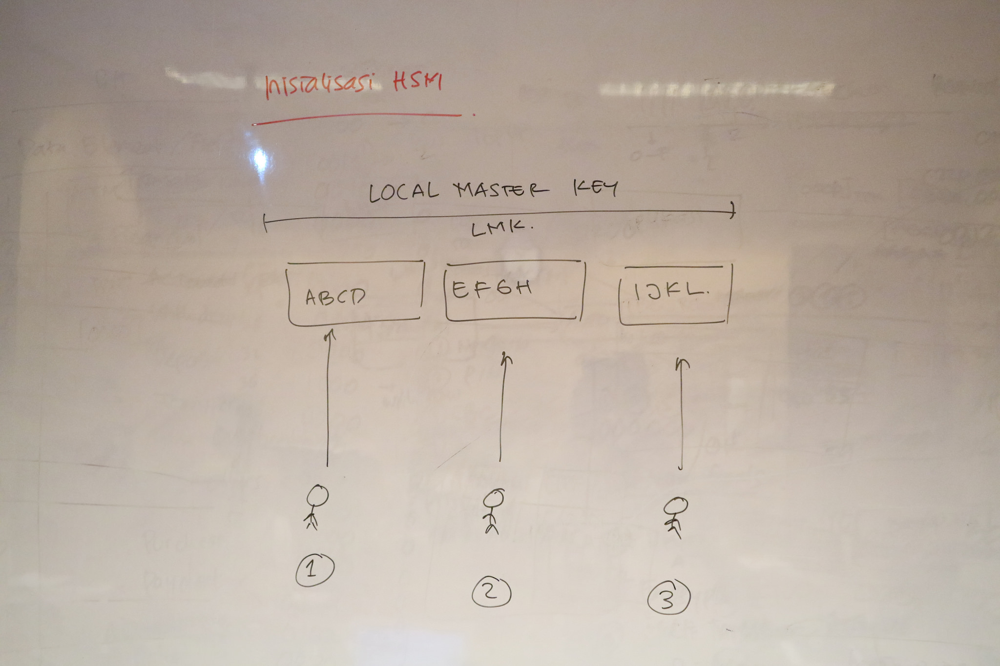
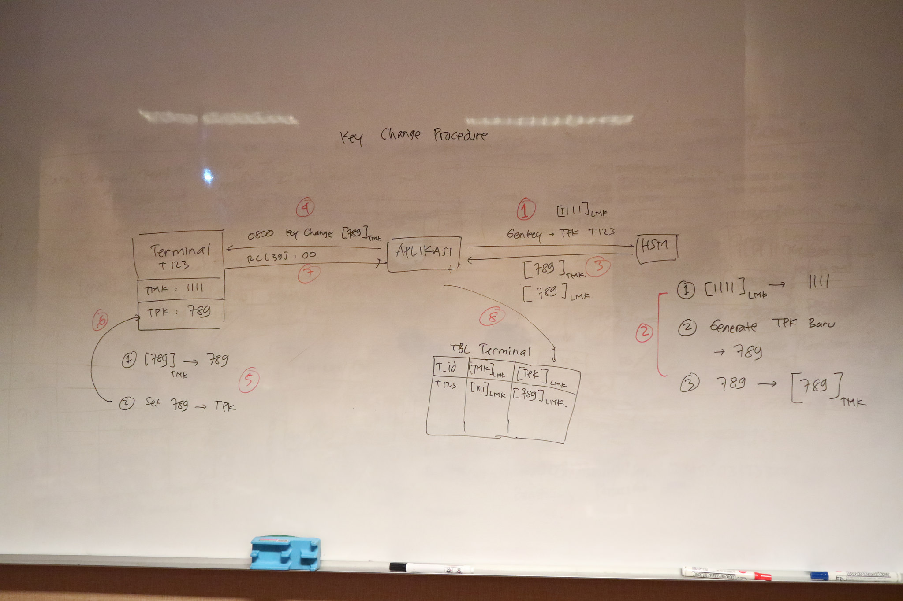
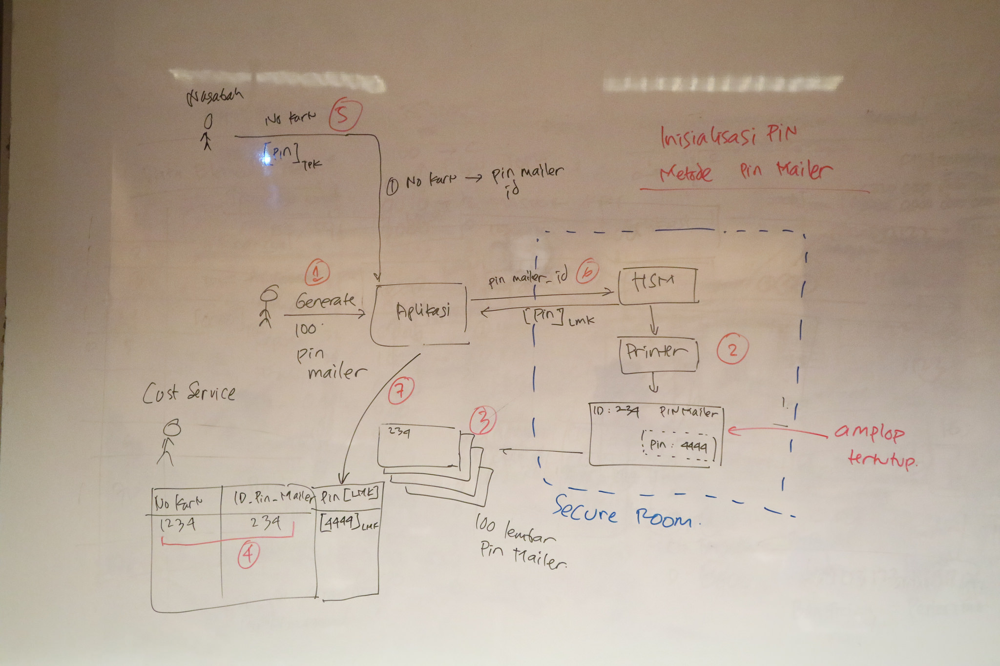
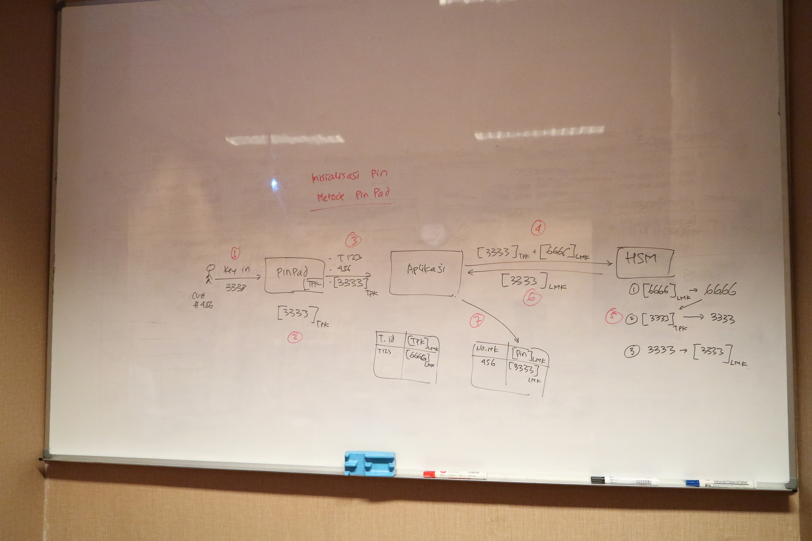

# Menggunakan HSM #

* HSM adalah singkatan dari Hardware Security Module
* HSM __bukan__ tempat penyimpanan key, dia hanya menyimpan satu key saja, yang disebut dengan Local Master Key (LMK)
* Semua key lain digenerate oleh HSM, kemudian diencrypt dengan LMK, baru diberikan ke kita. Key yang terencrypt dengan LMK ini yang kita simpan di database.
* Fitur terpenting HSM adalah anti-tampering. Dia bisa menghapus LMKnya bila terjadi pembongkaran paksa, sehingga LMK kita bisa disimpan dengan aman.

Beberapa istilah dalam penggunaan HSM:

* LMK : Local Master Key. Key utama yang digunakan untuk mengenkripsi key lain
* TMK : Terminal Master Key. Key di terminal (ATM atau EDC) yang digunakan untuk mengenkripsi key transaksi
* TPK : Terminal Pin Key. Key yang digunakan untuk mengenkripsi data transaksi (misalnya PIN nasabah)

## Inisialisasi LMK ##

LMK diinisialisasi dengan prosedur Key Ceremony. Biasanya ada beberapa orang (Key Custodian) yang bergiliran memasukkan key. LMK nantinya akan dihasilkan dari gabungan key yang diinput oleh Key Custodian

## Prosedur Key Change ##

Secara periodik, TPK di masing-masing terminal diganti baru untuk menghindari replay attack. Berikut adalah prosedur penggantian key.

## Prosedur Pencetakan PIN ATM (PIN Mailer) ##

## Prosedur Ganti PIN dengan PIN Pad ##

