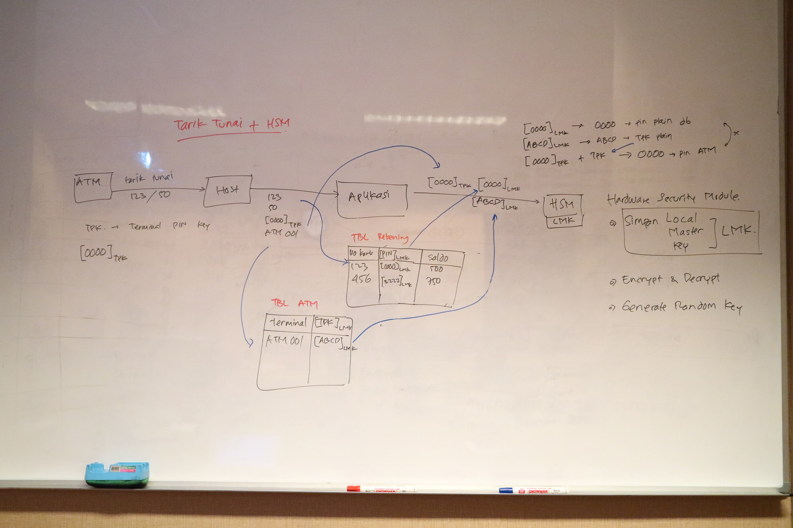
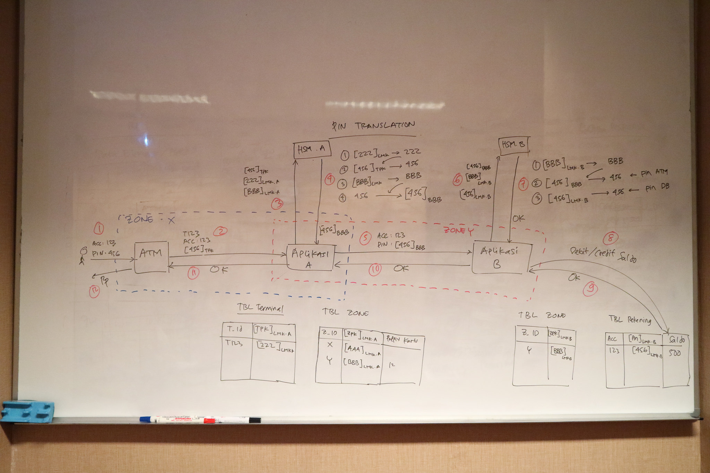

# Menggunakan HSM #

* HSM adalah singkatan dari Hardware Security Module
* HSM __bukan__ tempat penyimpanan key, dia hanya menyimpan satu key saja, yang disebut dengan Local Master Key (LMK)
* Semua key lain digenerate oleh HSM, kemudian diencrypt dengan LMK, baru diberikan ke kita. Key yang terencrypt dengan LMK ini yang kita simpan di database.
* Fitur terpenting HSM adalah anti-tampering. Dia bisa menghapus LMKnya bila terjadi pembongkaran paksa, sehingga LMK kita bisa disimpan dengan aman.

Beberapa istilah dalam penggunaan HSM :

* LMK : Local Master Key. Key utama yang digunakan untuk mengenkripsi key lain
* TMK : Terminal Master Key. Key di terminal (ATM atau EDC) yang digunakan untuk mengenkripsi key transaksi
* TPK : Terminal Pin Key. Key yang digunakan untuk mengenkripsi data transaksi (misalnya PIN nasabah)

Referensi :

* [HSM Basic](http://web.archive.org/web/20130405032855/http://jpos.org/wiki/HSM_basics)
* [HSM More](http://web.archive.org/web/20121225184341/http://jpos.org/wiki/HSM_basics_continued)

## Inisialisasi LMK ##

LMK diinisialisasi dengan prosedur Key Ceremony. Biasanya ada beberapa orang (Key Custodian) yang bergiliran memasukkan key. LMK nantinya akan dihasilkan dari gabungan key yang diinput oleh Key Custodian

## Prosedur Key Change ##

Secara periodik, TPK di masing-masing terminal diganti baru untuk menghindari replay attack. Berikut adalah prosedur penggantian key.

## Catatan tentang PIN ##

Di bawah ini akan ada beberapa gambar prosedur pemrosesan transaksi keuangan menggunakan PIN (Personal Identification Number). Penulisan PIN pada diagram di bawah sangat disederhanakan menjadi `[PIN]LMK` atau PIN yang dienkripsi dengan LMK.

Akan tetapi, prosedur aslinya tidak sesederhana itu. Ada beberapa perhitungan lagi yang melibatkan beberapa komponen PIN seperti :

* PAN : Primary Account Number, atau gampangnya adalah nomer kartu debit/kredit
* PIN asli. Yaitu nomer rahasia yang dipilih pemegang kartu debit/kredit
* PIN Generation/Verification Key : key yang digunakan untuk proses generate PIN
* PIN natural. Yaitu nilai yang dihasilkan dari mengenkripsi sebagian PAN dengan PIN Generation Key
* PIN Offset : selisih antara PIN asli dengan PIN natural. PIN Offset inilah yang disimpan di database aplikasi
* PIN block. Yaitu gabungan antara PIN dan nomer kartu (PAN). Ini adalah nilai yang dikirim oleh ATM/EDC ke server.

Berikut adalah beberapa referensi tentang prosedur perhitungan dan pemrosesan PIN :

* [Penjelasan alur pemrosesan PIN](http://web.archive.org/web/20160120101716/http://sidekick.windforwings.com/2008/02/how-are-atm-pins-validated.html)
* [Algoritma perhitungan PIN offset](http://www.ibm.com/support/knowledgecenter/en/linuxonibm/com.ibm.linux.z.wskc.doc/wskc_c_appdpinoffgenalg.html)
* [Algoritma perhitungan PIN block](http://www.ibm.com/support/knowledgecenter/SSLTBW_2.2.0/com.ibm.zos.v2r2.csfb400/pinbf.htm)
* [Panduan keamanan PIN](https://usa.visa.com/dam/VCOM/download/merchants/visa-issuer-pin-security-guideline.pdf)

Jadi, kalau pada diagram di bawah ada tulisan `[PIN]LMK`, jangan dibaca __PIN dienkripsi dengan LMK__, tapi bacalah __PIN diproses oleh HSM__.

## Prosedur Pencetakan PIN ATM (PIN Mailer) ##

## Prosedur Ganti PIN dengan PIN Pad ##

## Prosedur Verifikasi PIN dengan HSM pada waktu Tarik Tunai di ATM ##

## Prosedur PIN Translation bila bertransaksi di ATM yang berbeda dengan penerbit kartu ##

